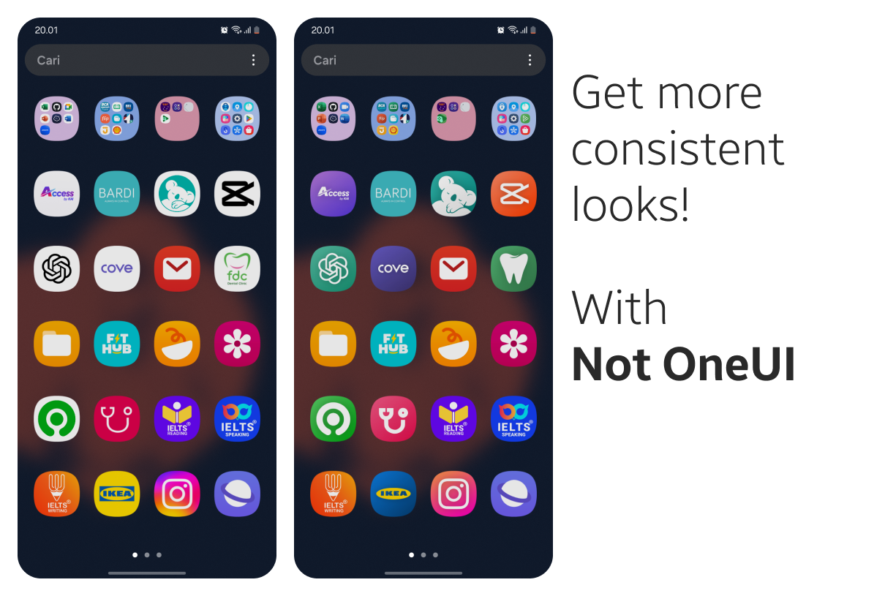

# Not OneUI Icons

**No more lazy icons!**

**Version 1.0**

This repository contains a custom icon set for One UI, featuring altered icons to provide a more consistent look. The default One UI icons often use white backgrounds, which may feel inconsistent with the overall aesthetic. This project aims to provide a sleeker alternative with modified icons.

## Features

- **Consistent Design**: All icons follow a more unified style, removing the default white background found in One UI.
- **Easy to Use**: Simply download the icons and replace the existing ones for a refreshed look.
- **Open Source**: You are free to modify and contribute to this repository.

## Installation

1. Download the icons as a ZIP file by clicking the button below.
2. Extract the contents and manually apply them to your device or app.

## Changelog

1. Added icons for basic apps like Google and Microsoft especially default with white backgrounds.
2. Added shadow and diagonal gradients.

## Contributing

We welcome contributions to improve or expand the icon set!

### How to Contribute:

1. **Fork** the repository.
2. Create a new branch for your changes.
3. **Make changes**: Add your modified icons or adjust the existing ones.
4. Commit and **push** your changes to your fork.
5. Open a **Pull Request** to merge your changes into the main repository.

Feel free to discuss your ideas or improvements by opening issues. We look forward to your contributions!
